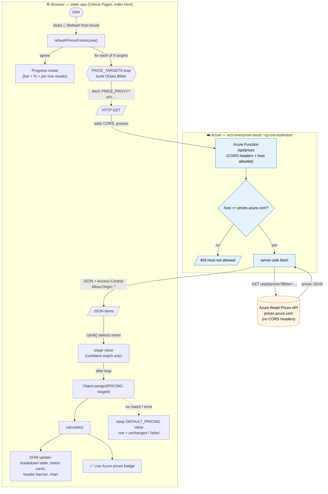

# Parabit Cloud Enterprise — Azure Cost Estimator

Interactive single-page cost calculator for the **Parabit Cloud Enterprise** physical access control platform. Estimates monthly and annual Azure spend across all 10 microservices, broken down by controller tier, service configuration, optional add-ons, failover scope, disaster recovery tier, data retention period, and tax rate.

## Live Demo

**[Open the Cost Estimator](https://cristhian-fierro.github.io/ParabitCloudEnterprise-CostEstimator/)**

> Prices are West US estimates re-verified against the Azure Retail Prices API (June 2026).  
> Always validate against the [official Azure Pricing Calculator](https://azure.microsoft.com/en-us/pricing/calculator/) before committing to a budget.

---

## Features

| Feature | Description |
|---|---|
| **4 Controller Tiers** | Starter (1–50) · Standard (51–500) · Professional (501–2,000) · Enterprise (2,000+) |
| **3 Service Configurations** | Minimum (cost-optimized) · Standard (balanced) · Advanced (enterprise HA) |
| **Live Cost Banner** | Monthly and annual totals (with tax) displayed in the page header, updated on every input change |
| **Failover Configuration** | None · Critical Services · All Services — replaces the old geo-failover checkbox |
| **Disaster Recovery Tier** | None · Standard DR (RTO 4h) · Advanced DR (RTO <1h) — independent of failover |
| **Data Retention** | Auto-calculated GB from actual event byte sizes + 50% security overhead; periods 3mo / 6mo / 1yr / 3yr / 10yr |
| **Optional Add-Ons** | SQL transaction buffer, backup plan (PITR + LTR), Cosmos continuous backup |
| **1-Year Reservations** | 35% discount toggle with break-even analysis |
| **Tax Rate** | Configurable tax rate (default 8.63%) applied to the pre-tax subtotal |
| **Cost by Category Chart** | Chart.js horizontal bar chart — spending by Azure service category |
| **Service Breakdown Table** | Line-item table with SKU labels, monthly and annual costs |
| **Glossary** | 30 plain-language definitions covering controllers, Azure services, pricing terms, and resilience concepts |
| **Live Price Refresh** | **🔄 Refresh from Azure** button pulls current per-unit prices from the Azure Retail Prices API (via a CORS proxy) with a progress modal, then recalculates live — see [Architecture](#architecture--live-price-refresh-dataflow) |
| **Excel Export** | Full cost breakdown downloadable as a formatted `.xls` spreadsheet |
| **Print** | Formatted print layout |

---

## Microservices Covered

The estimator prices all 10 Parabit Cloud Enterprise microservices:

| Microservice | Backend |
|---|---|
| Site Mgmt | SQL Elastic Pool |
| Access Point Mgmt | SQL Elastic Pool |
| Login Mgmt | SQL Elastic Pool |
| Device Mgmt | SQL Elastic Pool |
| Encryption Mgmt | SQL Elastic Pool |
| License Mgmt | SQL Elastic Pool |
| Job Scheduler | SQL Elastic Pool |
| Comm Service | Standalone SQL Database |
| Alarm Mgmt | Standalone SQL Database |
| Log Mgmt | Cosmos DB |

Shared infrastructure (AKS, App Gateway WAF_v2, App Service, Azure Functions, Blob Storage, Key Vault, Entra ID, Log Analytics, egress) is included in all tiers.

---

## Running Locally

No build step, no dependencies to install. Open the file directly:

```bash
# Option 1 — open directly in browser
start index.html

# Option 2 — Python static server
python -m http.server 8080

# Option 3 — Node (npx)
npx serve .
```

Then navigate to `http://localhost:8080`.

---

## Project Structure

```
index.html          # Entire application — CSS + HTML + JavaScript in one file
azure-proxy/        # Azure Function: CORS proxy for the Azure Retail Prices API (live refresh)
  src/functions/prices.js   # The proxy handler (host-locked to prices.azure.com)
  deploy.ps1               # One-command deploy to the acs-enterprise-cloud subscription
  README.md                # Proxy setup + deploy instructions
CLAUDE.md           # Developer notes for Claude Code (AI assistant)
README.md           # This file
```

The app's only external dependency is [Chart.js 4.4.1](https://www.chartjs.org/), loaded from CDN — no package manager, no bundler, no backend. The `azure-proxy/` folder is **optional** infrastructure: it's only needed to power the live **Refresh from Azure** button, since `prices.azure.com` sends no CORS headers and cannot be called directly from the browser.

---

## Architecture — Live Price Refresh (dataflow)

The estimator ships with built-in West US prices. The **🔄 Refresh from Azure** button pulls the *current* per-unit meter prices on demand. Because `prices.azure.com` returns no `Access-Control-Allow-Origin` header, the request is routed through a small **Azure Function** (`azure-proxy/`) that fetches server-side and re-serves the JSON with CORS headers. Only per-unit meters are refreshed; composite multi-VM bundle estimates are left untouched.



> Without a configured proxy (`PRICE_PROXY` empty in `index.html`), the refresh fails gracefully and the app keeps using its built-in defaults. See [`azure-proxy/README.md`](azure-proxy/README.md) to deploy the proxy.

---

## Changelog

| Version | Date | Summary |
|---|---|---|
| v1.4.0 | 2026-06-12 | Chart bug fix, header cost banner, Annual Subtotal card, price re-verification, Glossary |
| v1.3.0 | 2026-06-12 | Failover selector, DR tier, Data Retention rework, tax support |
| v1.2.0 | 2026-05-20 | Egress bandwidth line item, version number, Changelog section |
| v1.1.0 | 2026-05-16 | Tiered service configurations, optional add-ons, How to Use guide |
| v1.0.0 | 2026-05-15 | Initial release |
